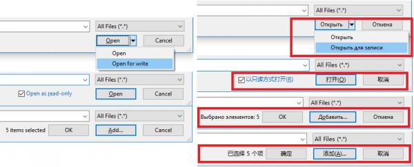

# Common Dialog Class (Yet another one)

SRC:http://www.vbforums.com/showthread.php?858087-vb6-Common-Dialog-Class-(Yet-Another-One)
AUTHOR: LaVolpe

## DESCRIPTION


Then enclosed class combines the Windows XP/Win2000 Open/Save dialog that uses APIs to generate the dialog with the IFileDialog interface used in Vista and higher. Basically, the class is a unicode-friendly dialog option as a drop-in, self-contained class. Do note that the class has been hard-coded to not run on any O/S less than XP/Win2000. Also included in the class is the old-style "Browse for Folder" dialog. The class can get all dialogs to callback to itself and forward you the events.

Though the class makes heavy use of calling to interfaces not known to VB, it does not use type libraries (TLBs). However, I have made every effort to make it compatible to TLBs you may be using in your project. In other words, objects returned by this class through its events or functions should be 100% compatible with a TLB that defines interfaces that this class is using. Anything less would be an oversight by me and considered a "bug report".

This class has absolutely no real benefit over existing code you may already be using unless you want more advanced options. Some of those options include:

* XP/Win2000. APIs used to display the dialogs
    * class-generated thunks for hooking the dialog. Those thunks result in raised events from the class to its host, i.e., form, usercontrol, other class, etc.
    * auto-sizing buffer for multi-selection to prevent the ugly 'buffer too small' error and forcing users to go back and try again

* Vista and higher. IFileDialog interface used to display the dialogs
    * Customize by adding additional controls to the dialog and receive events for those controls
    * Add a read-only checkbox back to the dialog that populates the common OFN_ReadOnly flag
    * Interact with the dialog via class-generated thunks that raise events from the class to its host
    * Use embedded custom configurations. There are currently 7 of those.

        1. Browse for Folders while showing file names too
        2. Navigate into compressed folders (zips) while being able to select the zip itself or one of its contained files or any other file
        3. Show both files and folders and be able to select either folders or files or both
        4. Four "basket mode" settings which allows selecting files/folders across multiple directories. Similar to "Add to my Cart" button.

    * All custom mode button captions can be assigned by you or default to locale-aware captions (see screenshot below)

Nearly all of the advanced Vista+ options are incorporated into this class, but not all. If you find you need anything more that is not offered, modify as needed.

If you just want a simple Open/Save dialog where the filter is: All Files, the code needed for the dialog is as simple as:

```vb
    Dim cBrowser As CmnDialogEx
    Set cBrowser = New CmnDialogEx
    If cBrowser.ShowOpen(Me.hWnd) = True Then
        MsgBox "File Selected: " & cBrowser.FileName
    End If
```

Want to add the "Read-Only" checkbox back to the dialog?

```vb
    Dim cBrowser As CmnDialogEx
    Set cBrowser = New CmnDialogEx
    cBrowser.Controls_AddReadOnlyOption 100    ' << user-defined Control ID
    If cBrowser.ShowOpen(Me.hWnd) = True Then
        MsgBox "File Selected and Read-Only opted for: " & CBool(cBrowser.Flags And Dlg_ReadOnly)
    End If
```


Want a "Browse for Folder" like dialog that also shows files (not doable with newer dialog using standard options)?

```vb
    Dim cBrowser As CmnDialogEx
    Set cBrowser = New CmnDialogEx
    cBrowser.Controls_SetCustomMode cm_BrowseFoldersShowFiles
    If cBrowser.ShowOpen(Me.hWnd) = True Then
        MsgBox "Selected Folder: " & cBrowser.FileName
    End If
```


The screenshot below highlights locale-aware captions. The only one I haven't been able to find is a locale-aware caption like: All Files. That would be a nice-touch.
Edited: Found it in shell32.dll ID: 34193 for Vista+. XP/Win2K will still use hard-coded value as needed



The sample project offers examples of several dialog variations. The class itself is heavily commented.

```
UPDATE HISTORY
-----------------
5 Aug 18 - Massive changes see post #13 for  details
28 May 18 - Enhancements & altered format of FileName property return value 
        when multiple files selected
23 Jan 18 - Minor fixes
        Fixed a couple locale-aware captions being retrieved from common dlls
        Addressed case where Windows can convert "Open" button to unexpected split-button
21 Jan 18 - initial release
```


FYI: If you are using any previous version, do not simply replace it with the one in the zip below. So many changes were made to this version that it is not compatible with previous ones. To ensure no confusion between versions, the class name was also changed from OSDialogEx to CmnDialogEx.

Minor fix to be applied after downloading. Next time zip is uploaded, fix will be applied and this paragraph will be removed. Test code left as-was by mistake.

```
- Routine: InitDir property Let
- Action:
relocate this line: If Len(Value) = 0& Then Exit Property
relocate to immediately above this line: If InStr(Value, ":") Then
- Reason: can't reset InitDir to null otherwise, without calling the Clear method
```


